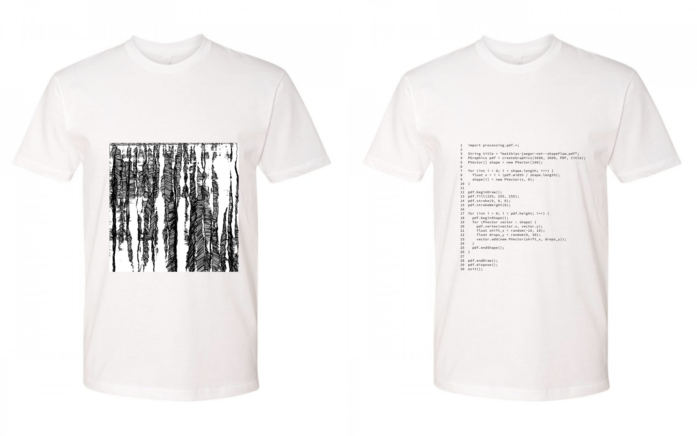

# shirts-processed
Designs for T-Shirts made with the Processing IDE

## shapeFlow commented

```java
// Using the pdf library in static mode: no setup()
import processing.pdf.*;

// Just to have the author on the shirt ;)
String title = "matthias-jaeger-net--shapeFlow.pdf";

// Create a graphics buffer in print resolution?
PGraphics pdf = createGraphics(3600, 3600, PDF, title);

// Consider a shape as an array of 100 vectors
PVector[] shape = new PVector[100];

// Initialize the shape on the top edge of the pdf
for (int i = 0; i < shape.length; i++) {

  // Space out the points proportional to the width
  float x = i * (pdf.width / shape.length);

  // Add the points to the shape
  shape[i] = new PVector(x, 0);
}

// Start drawing the pdf
pdf.beginDraw();

// Set the fill color to white
pdf.fill(255, 255, 255);

// Set the stroke color to black 
pdf.stroke(0, 0, 0);

// Set the stroke weight for printing 
pdf.strokeWeight(8);

// Stack the shape 3600 times on top of each other 
for (int i = 0; i < pdf.height; i++) {

  pdf.beginShape();
  
  // Loop over the shapes vectors
  for (PVector vector : shape) {
    
    // Add the vector to the shape 
    pdf.vertex(vector.x, vector.y);
    
    // Create a random motion vector 
    // that's pointing downwards, mostly
    float shift_x = random(-10, 10);
    float drops_y = random(0, 30);
    
    // Then add the changes to the shape vector 
    vector.add(new PVector(shift_x, drops_y));
  }
  // Done with looping and close the shape
  pdf.endShape();
}

// Done with stacking shapes on top of each other
pdf.endDraw();

// Has to be called in static mode, closes the file
pdf.dispose();

// Done with all quit the program
exit();
```
